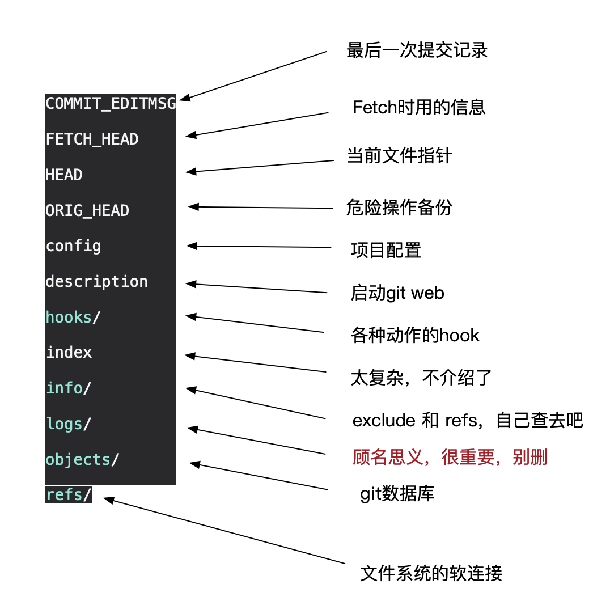
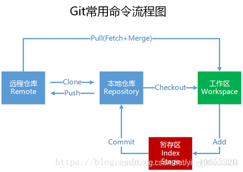

# 提醒

git不像其他Linux命令和工具，见一个现查，会导致很长时间没搞明白，应像学KMP一样第一次就学会，由于版本结构就是树，因此通过图或树来理解效果更好。

# 重要概念
+ .git下重要文件：
    + HEAD文件：当前位置指针，指向当前正在工作的那个commit
    + objects：git的数据库
    + refs：存储指向数据（分支）的提交对象的指针，类似symbol link
    + index：文件保存暂存区信息,非常重要。
    + info：excluede用于排除规则。

+ 工作区：本地磁盘上的目录，仅一个。工作区是**独立**于各个分支的。
+ 暂存区：数据暂时存放的区域，类似于工作区写入版本库前的**缓存区**。是一个文件，保存了下次将提交的文件列表信息，也被称作“索引”。暂存区是独立于各个分支的。
+ 版本库：也叫**本地仓库**，存放所有已经提交到本地仓库的代码版本
+ 远程仓库：远程托管代码的仓库。
+ head指针：每次指向版本树中某一个节点，每次将代码提交到版本库时，在head后新建一节点，并将工作区中所有内容放入其中，并将head指向该节点。当然head可切换其他分支。（类似**链表尾插入新节点**）

# git常用命令
+ git config --global user.name xxx：设置全局用户名，信息记录在~/.gitconfig文件中
+ git config --global user.email xxx@xxx.com：设置全局邮箱地址，信息记录在~/.gitconfig文件中
  
+ git **init**：将当前目录配置成git仓库，信息记录在隐藏的.git文件夹中
+ git **add** XX：将XX文件添加到暂存区
+ git add .：将所有待加入暂存区的文件加入暂存区
+ git rm --cached XX：将文件从仓库索引目录中删掉
+ git **commit** -m "给自己看的备注信息"：将暂存区的内容提交到当前分支
+ git **status**：查看仓库状态
+ git diff XX：查看XX文件相对于暂存区修改了哪些内容
+ git **log**：查看当前分支的所有版本
+ git reflog：查看HEAD指针的移动历史（包括被回滚的版本）

+ git remote add origin git@git.acwing.com:xxx/XXX.git：将本地仓库关联到远程仓库
+ git **push** -u (第一次需要-u以后不需要)：将当前分支推送到远程仓库
+ git push origin branch_name：将本地的某个分支推送到远程仓库
+ git push --set-upstream origin branch_name：设置本地的branch_name分支对应远程仓库的branch_name分支
+ git push -d origin branch_name：删除远程仓库的branch_name分支

+ git **clone** git@git.acwing.com:xxx/XXX.git：将远程仓库XXX下载到当前目录下
  
+ git **checkout** -b branch_name：创建并切换到branch_name这个分支
+ git checkout branch_name：切换到branch_name这个分支
+ git checkout — XX或git restore XX：将XX文件尚未加入暂存区的修改全部撤销

+ git pull：将远程仓库的当前分支与本地仓库的当前分支合并
+ git **pull** origin branch_name：将远程仓库的branch_name分支与本地仓库的当前分支合并
  
+ git **reset** --hard HEAD^ 或 git reset --hard HEAD~：将代码库回滚到上一个版本
+ git reset --hard HEAD^^：往上回滚两次，以此类推
+ git reset --hard HEAD~100：往上回滚100个版本
+ git reset --hard 版本号：回滚到某一特定版本

+ git **branch**：查看所有分支和当前所处分支
+ git merge branch_name：将分支branch_name合并到当前分支上
+ git branch -d branch_name：删除本地仓库的branch_name分支
+ git branch branch_name：创建新分支
+ git branch --set-upstream-to=origin/branch_name1 branch_name2：将远程的branch_name1分支与本地的branch_name2分支对应

+ git stash：将工作区和暂存区中尚未提交的修改存入栈中
+ git stash apply：将栈顶存储的修改恢复到当前分支，但不删除栈顶元素
+ git stash drop：删除栈顶存储的修改
+ git stash pop：将栈顶存储的修改恢复到当前分支，同时删除栈顶元素
+ git stash list：查看栈中所有元素

