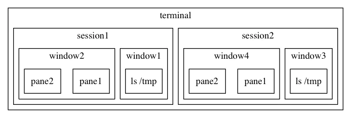
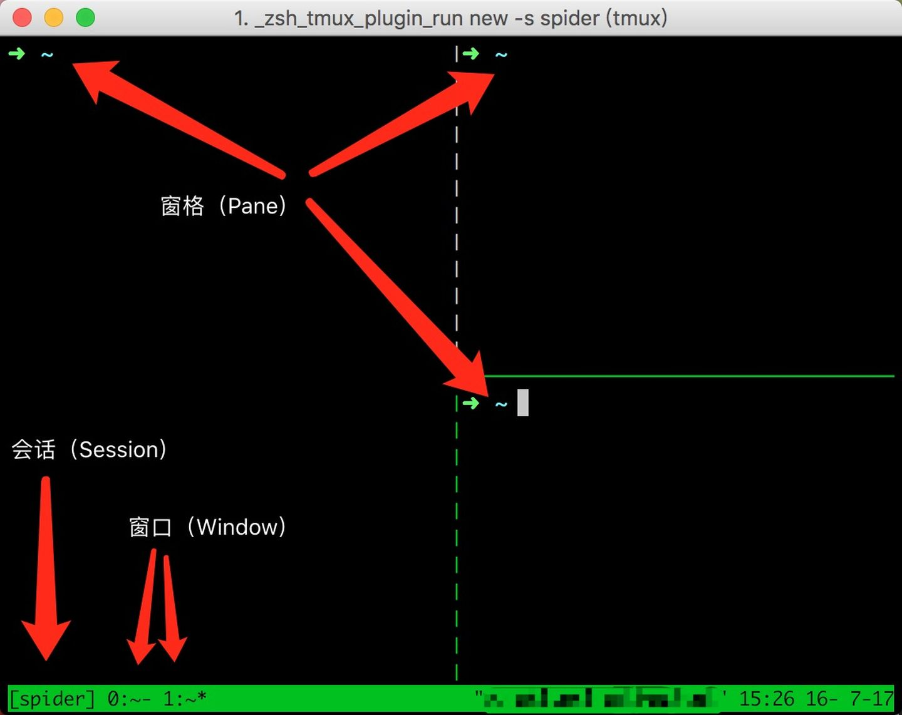
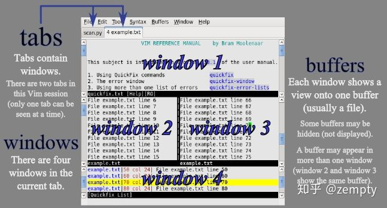

# tmux
## 基本概念
### 功能:
+ 分屏。
+ 可以连接本地或远程的 sessions
+ 允许断开Terminal连接后，继续运行进程。
### 结构
一个tmux(被设计c/s结构，启动session实际是client,server在服务器)可以包含多个session，一个session可以包含多个window，一个window可以包含多个pane。

### 配置
tmux 的配置文件位于 $HOME/.tmux.conf (以及一个全局的 /etc/tmux.conf)。在配置文件中可设置**前缀**
### 常用操作
prefix - ? 可以随时查看快捷键列表
+ tmux:新建session，含一window，window含一pane，pane打开一shell。
+ tmux a:打开之前挂起的session。
+ Ctrl + a % 左右平分成两pane。
+ Ctrl + a " 上下平分成两个pane。
+ 按住ctrl + a的同时按方向键，可调整panel尺寸。
+ 鼠标拖动pane之间的分割线，可以调整分割线的位置。
+ Ctrl + d:关闭当前pane或window或ession。
+ 鼠标点击可以选pane。
+ ctrl + a，然后按方向键:选择相邻的pane。
+ ctrl + a o 顺序跳转panel
+ ctrl + a q num 选择编号num的panel
+ ctrl + a s:选择其它session。
    + 方向键 —— 上:选择上一项 session/window/pane
    + 方向键 —— 下:选择下一项 session/window/pane
    + 方向键 —— 右:展开当前项 session/window
    + 方向键 —— 左:闭合当前项 session/window
+ ctrl + a z:将当前pane全屏/取消全屏。
+ ctrl + a d:挂起当前session。
+ Ctrl + a c:在当前session中创建一个新的window。
+ Ctrl + a w:选择其他window，操作方法与(12)完全相同。
+ Ctrl + a &:关闭当前窗口。
+ Ctrl + a 1-9:切换到指定窗口
+ Ctrl + a p:切换的上一个窗口。
+ Ctrl + a n:切换到上一个窗口。
+ Ctrl + a l:在前后两个窗口之间切换。
+ Ctrl + a , 重命名当前窗口；这样便于识别
+ Ctrl + a f	在所有窗口中查找指定文本
+ Ctrl + a PageUp:翻阅当前pane内的内容。
+ 鼠标滚轮:翻阅当前pane内的内容。
+ 在tmux中选中文本时，需要按住shift键。（仅支持Windows和Linux，不支持Mac，不过该操作并不是必须的，因此影响不大）
+ tmux中复制/粘贴文本的通用方式:
    + 按下Ctrl + a后松开手指，然后按[
    + 用鼠标选中文本，被选中的文本会被自动复制到tmux的剪贴板
    + 按下Ctrl + a后松开手指，然后按]，会将剪贴板中的内容粘贴到光标处

# vim
## vim几种模式
当编程时，会经常在文件间进行切换、阅读、浏览和修改代码，而非连续编写一大段文字。你会把大量时间花在阅读/编辑而不是写代码，所以vim是一个多模态编辑器。
1. 一般命令模式:
    默认模式。命令输入方式:类似于打游戏放技能，按不同字符，即可进行不同操作。可以复制、粘贴、删除文本等。
2. 编辑模式:
    在一般命令模式里按下i，会进入编辑模式。按下ESC会退出编辑模式，返回到一般命令模式。
3. 命令行模式:
    在一般命令模式里按下:/?三个字母中的任意一个，会进入命令行模式。命令行在最下面。可以查找、替换、保存、退出、配置编辑器等
4. 可视化模式:
   为便于选取文本，VIM 引入Visual模式。 先将光标移到段首，在普通模式下按 v 进入字符可视模式(V是行、ctrl V块可视化模式)，然后移动光标选取。
5. 替换模式，替换文本，但感觉用的不多。R进入替换模式，r进入单字符替换模式。和编辑模式不同注意区分。
如图:
## 常用命令
注意命令可组合，并且有规律。
1. 模式切换，常用有(vim file、i、esc、:、v、:wq/:x)见上图
2. 移动
    + n h/j/k/l对应左/下/上/右移动n个字符
    + 0或功能键[Home]:光标移动到本行开头
    + ^/$或[End]:光标移动到本行第一/最后字符，与上个不同。 
    + G/gg:光标移动到最后/第一行(等价1G)
    + :n或nG:n为数字，光标移动到第n行
    + w/b/e/ge 移动到对应下一单词首/上单词首/当前单词尾/前单词尾
    + n\<Space>:光标会向右移动n个字符
    + n\<Enter>:光标向下移动n行
3. 查找
    + /word/?word:向光标之下/上寻找第一个值为word的字符串。
    + n/N:正/反向重复前一个查找操作
    + :n1,n2s/word1/word2/g(c):n1与n2为数字，在第n1行与n2行之间寻找word1这个字符串，并将该字符串替换为word2(且用户确认)
4. 删除
    + n x:删除游标所在n个字符,Delete等价于1 x
    + d:删除选中的文本
    + n dd: 向下删除n行
    + d$或D/d^:删除至行尾/首
    + dG/d1G:删除至文尾/首
    + n X:删游标前n个字符
    + dnw:删除n个单词
5. 复制
    + y:复制选中的文本
    + n yy: 向下复制n行
    + y$/y^:复制至行尾/首
    + yG/y1G:复制至文尾和首
    + ynw:复制n个单词
6. 粘贴
    + p/P: 将复制的数据粘贴在光标后/前
    + ddp:剪切并粘贴
7. 其他
    + .: 重复上次命令
    + u/ctrl + r:撤销/取消撤销
    + 大于号 >/<:将选中的文本整体向右/左缩进一次
    + :set paste/nopaste 设置成粘贴模式，取消代码自动缩进
    + :set nu/nonu 显示行号
    + gg=G:将全文代码格式化
    + Ctrl + q:当vim卡死时，可以取消当前正在执行的命令
    + 滚屏:CTRL-U/D向上/下移动半屏。CTRL-E/Y向上/下滚动一行。CTRL-F/B向前/后滚动一整屏。zz/zt/zb当前行置为屏幕正中央/顶端/底端
    + Ctrl + s/q终止/继续向中断输出

## vim补充
### 学习编辑器包含步骤
+ 阅读教程（如这节课提供的资源）
+ 坚持使用它完成所有编辑工作（即使一开始使工作效率降低）
+ 随时查询，若某个操作看起来像是有更方便的实现方法，一般真的会有

若能遵循上述步骤，并坚持使用vim完成所有编辑任务，那么学习编辑器的过程一般是：头两个小时，学习vim的基本操作，如打开和编辑文件、保存与退出、浏览缓冲区。当时间累计达20小时后，用vim效率应和使用老编辑器一样快。之后，其益处开始显现：有足够的知识和肌肉记忆后，用vim将大大节省时间。vim是些复杂且强大的，永远有新东西可学：学的越多，效率越高。

其次，个人认为任何知识学习都是这样，先阅读入门教程，然后用起来，变学边用。

### vim的哲学
编程的时，会把大量时间花在阅读/编辑而不是在写代码。所以，Vim 是一个多模态编辑器;Vim 是可编程的（可用 Vimscript或像Python），Vim的接口本身也是程序语言：键入操作是命令，且这些命令也是可组合的。Vim避免使用鼠标，因为太慢；Vim甚至避免用方向键因为需要太多的手指移动。这样的设计哲学使Vim成为能跟上思维速度的编辑器。

个人认为好用的工具都应是可编程，且接口本身也是编程语言，并且操作是可组合的。

### 几个概念
类似tmux，vim结构由几个概念组成，buffer、tab、window。buffer可有多个tab,tab可有多个window。注意：每个window显示一个buffer，但buffer和window不一一对应，window只是视角，且一个buffer可在多个window打开，甚至同一tab类多个window类打开。如图：

常用操作：（~表示同上，^表示ctrl,/表示或，（）表示可选）
|   概念 |     创建    |    关闭     |   列出   | 上个 | 下个 | num name switch |
|:------:| :--------- | :-------- | :------- | :---- | :---- | :----------:|
| buffer |   :e name   | :close/q |   :ls   |  :bp   |   :bn  | :b nu/ame|
|  tab   |:tabnew1| ~、:tabc |  :tabs  | :tabp  |   :tabn |(num)gt|
| window |:sp/vs|~、^wq|  看    |^wk/h|^wj/l|^w w|
